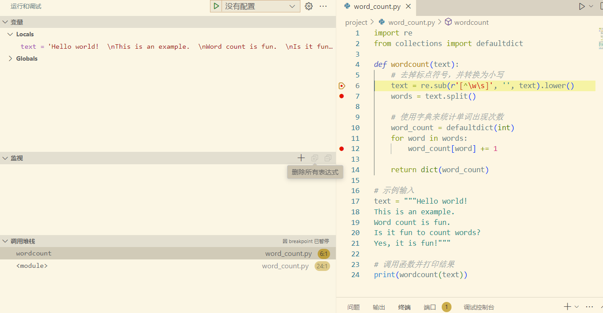
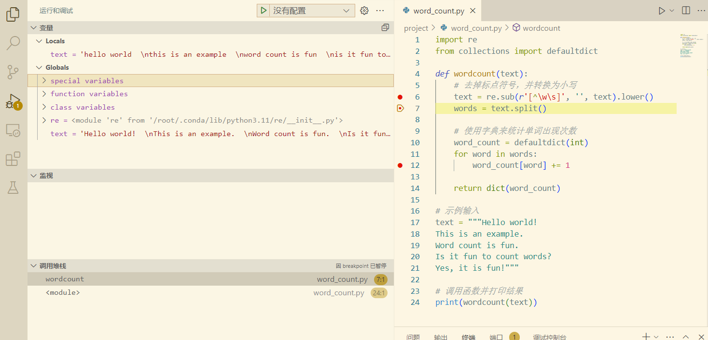
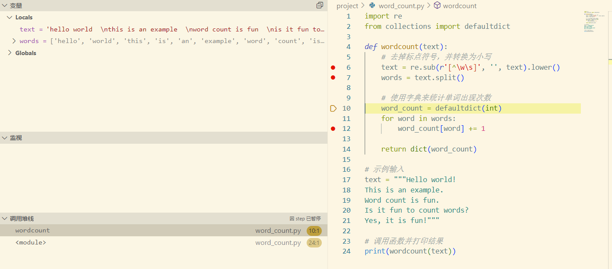
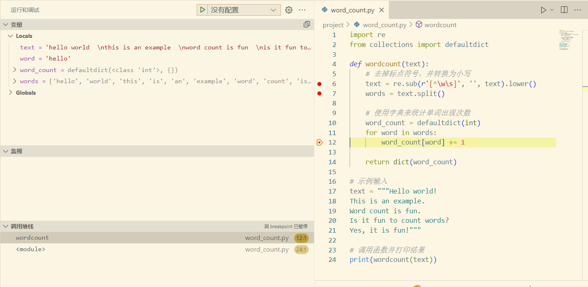
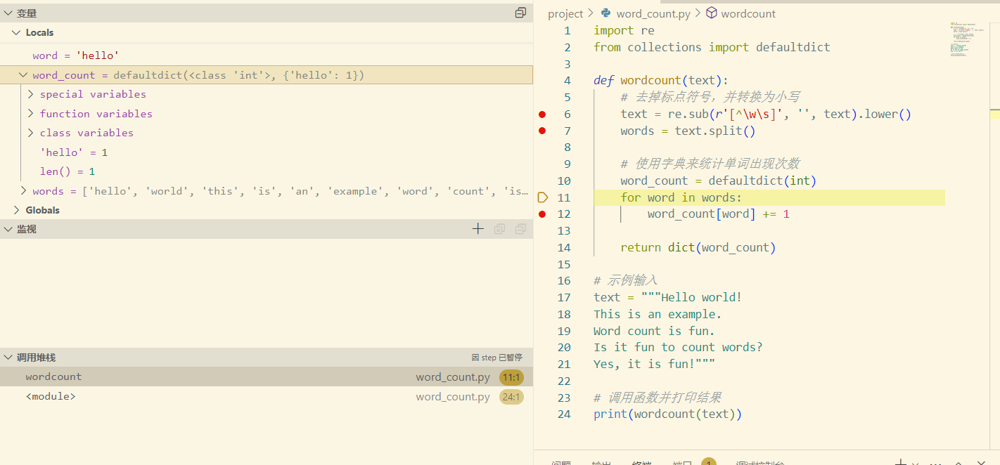

## Part 1: Word Count输出


## Part 2: Debug笔记

### 我们在代码中插入断点：

断点位置 6 行：文本处理之前<br />
断点位置 8 行：文本分割成单词之后<br />
断点位置 10 行：单词计数过程中<br />

### 使用断点调试

1. 检查文本处理：

```python
text = re.sub(r'[^\w\s]', '', text).lower()
```

2. 检查单词列表：

```python
words = text.split()
```

3. 检查单词计数：

```python
word_count[word] += 1
```

### 调试笔记和截图

1. 初始代码，我们得到一个名为text的local变量，以string格式存储。



2. 点击向前一步，程序根据正则表达式完成对text的转小写以及去标点符号操作。程序标识指定即将运行下一行。



3. 继续运行，程序执行text分割。我们可以看到text根据空格被分割开，得到的数组被存储于words变量里。



4. 继续运行，程序到达下一个断电，进入循环内部。我们可以看到，一个空字典word_count被初始化出来，同时循环指向数组内部第一个元素。



5. 循环内部的代码，我们可以看到，word作为key被加入字典，同时它的频率从0变到1。




