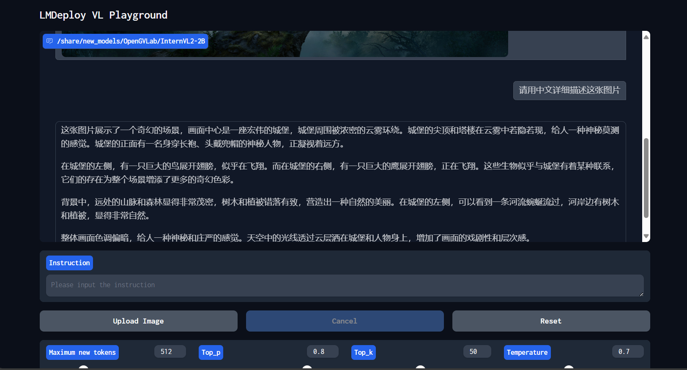

## 基础任务

- 使用 Cli Demo 完成 InternLM2-Chat-1.8B 模型的部署，并生成 300 字小故事，记录复现过程并截图。

创建cli_demo.py

启动demo并生成故事

## 进阶任务

- 使用 LMDeploy 完成 InternLM-XComposer2-VL-1.8B 的部署，并完成一次图文理解对话，记录复现过程并截图。

使用 LMDeploy 启动Gradio 服务。

- 使用 LMDeploy 完成 InternVL2-2B 的部署，并完成一次图文理解对话，记录复现过程并截图。

