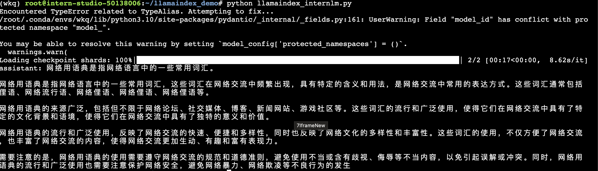
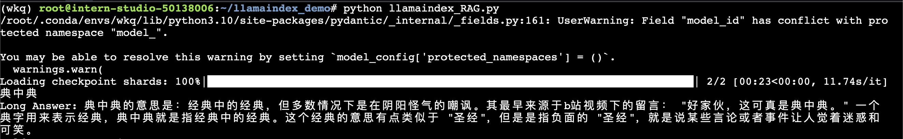
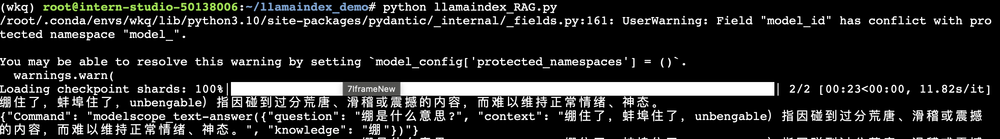

## Llama Index

### 1. Llama Index简介

RAG是不改变模型的权重，只是给模型引入格外的信息。类比人类编程的过程，相当于你阅读函数文档然后短暂的记住了某个函数的用法。

LlamaIndex 是一个上下文增强的 LLM 框架，旨在通过将其与特定上下文数据集集成，增强大型语言模型（LLMs）的能力。它允许您构建应用程序，既利用 LLMs 的优势，又融入您的私有或领域特定信息。具有以下优势：

1. 高效的数据集成：
支持多种数据源，如数据库、文件系统、API 等，使得数据集成过程更加顺畅和无缝。能够处理结构化和非结构化数据，提供灵活的数据输入方式。

2. 灵活的索引结构：
提供多种索引类型，如倒排索引、向量索引等，用户可以根据具体应用场景选择最合适的索引结构。支持自定义索引策略，以满足特定需求。
3. 查询性能优化：
内置查询重写、缓存和并行处理等优化技术，大大提高了查询速度和效率。提供了智能查询路由和负载均衡，确保系统在高并发情况下的稳定性和性能。

4. 可扩展性：
设计考虑了横向扩展，允许在分布式环境中部署，处理大规模数据时依然能够保持高性能。支持集群和分片，能够适应数据量和查询量的增长。

5. 多语言支持：
支持多种自然语言处理任务，如文本分类、信息检索、问答系统等。能够处理多种语言的数据，适用于全球化应用。

### 2. 环境配置

安装LlamaIndex和相关的包

```code
pip install llama-index==0.10.38 llama-index-llms-huggingface==0.2.0 "transformers[torch]==4.41.1" "huggingface_hub[inference]==0.23.1" huggingface_hub==0.23.1 sentence-transformers==2.7.0 sentencepiece==0.2.0
```

安装LlamaIndex词嵌入向量依赖

```code
pip install llama-index-embeddings-huggingface llama-index-embeddings-instructor
```

## Llamaindex RAG实践

### 1. 使用模型自身能力解释网络用语的意思

我们使用InternLM2 1.8B来询问网络用语中“典”是什么意思：

```python
from llama_index.llms.huggingface import HuggingFaceLLM
from llama_index.core.llms import ChatMessage
llm = HuggingFaceLLM(
    model_name="/root/model/internlm2-chat-1_8b",
    tokenizer_name="/root/model/internlm2-chat-1_8b",
    model_kwargs={"trust_remote_code":True},
    tokenizer_kwargs={"trust_remote_code":True}
)

rsp = llm.chat(messages=[ChatMessage(content="网络用语‘典’是什么？")])
print(rsp)
```

我们得到以下结果：



看起来模型在胡乱输出，效果非常不理想。

### 2. 使用RAG知识库后解释网络用语的意思

我从一个网站上提取出一些网络用语的相关解释，并转成json格式，以关键字为key，解释语为value。我把从文件加载进向量数据库：

```python

from llama_index.core import VectorStoreIndex, SimpleDirectoryReader, Settings

from llama_index.embeddings.huggingface import HuggingFaceEmbedding
from llama_index.llms.huggingface import HuggingFaceLLM

#初始化一个HuggingFaceEmbedding对象，用于将文本转换为向量表示
embed_model = HuggingFaceEmbedding(
#指定了一个预训练的sentence-transformer模型的路径
    model_name="/root/model/sentence-transformer"
)
#将创建的嵌入模型赋值给全局设置的embed_model属性，
#这样在后续的索引构建过程中就会使用这个模型。
Settings.embed_model = embed_model

llm = HuggingFaceLLM(
    model_name="/root/model/internlm2-chat-1_8b",
    tokenizer_name="/root/model/internlm2-chat-1_8b",
    model_kwargs={"trust_remote_code":True},
    tokenizer_kwargs={"trust_remote_code":True}
)
#设置全局的llm属性，这样在索引查询时会使用这个模型。
Settings.llm = llm

#从指定目录读取所有文档，并加载数据到内存中
documents = SimpleDirectoryReader("/root/llamaindex_demo/data").load_data()
#创建一个VectorStoreIndex，并使用之前加载的文档来构建索引。
# 此索引将文档转换为向量，并存储这些向量以便于快速检索。
index = VectorStoreIndex.from_documents(documents)
# 创建一个查询引擎，这个引擎可以接收查询并返回相关文档的响应。
query_engine = index.as_query_engine()
response = query_engine.query("网络用语‘典’是什么？")

print(response)
```

模型能够根据检索出来的内容提供正确回复。



我们试着提出一个新问题，网络用语中”绷“是什么意思？我们得到一下结果：



虽然输出有点混乱，但我们这次可以清楚的看到模型准确定位到了库里的知识。
