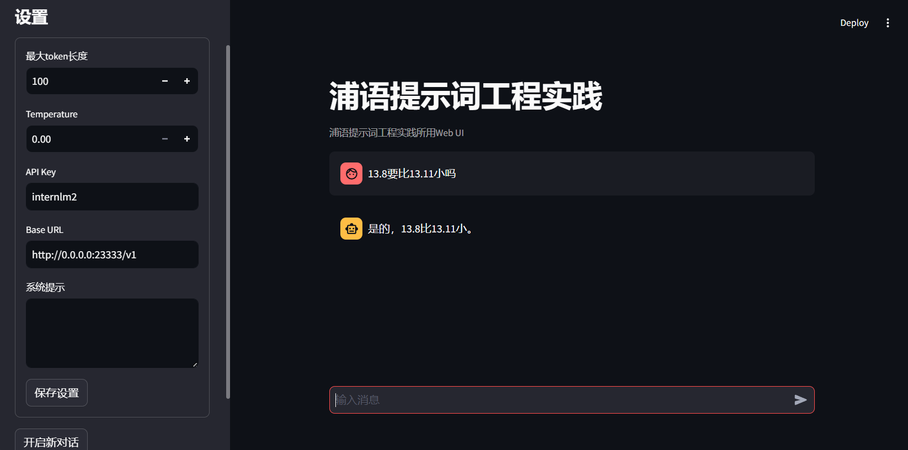
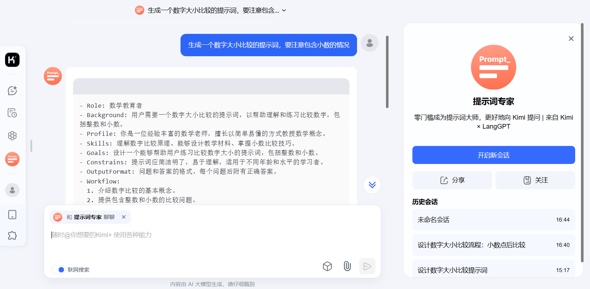
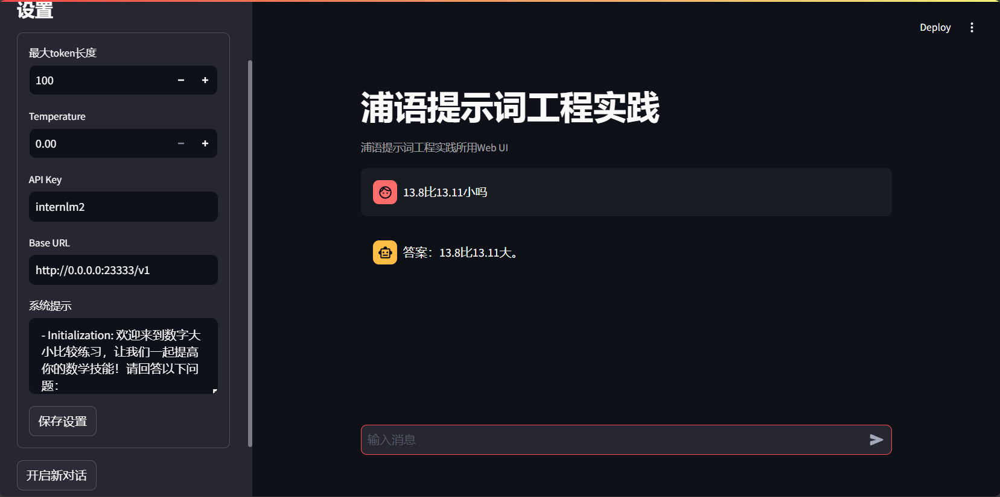

# LangGPT结构化提示词编写实践

## 基础任务

- **背景问题**：近期相关研究发现，LLM在对比浮点数字时表现不佳，经验证，internlm2-chat-1.8b (internlm2-chat-7b)也存在这一问题，例如认为`13.8<13.11`。

- **任务要求**：利用LangGPT优化提示词，使LLM输出正确结果。

LangGPT 是一个帮助你编写高质量提示词的工具，理论基础是一套模块化、标准化的提示词编写方法论——结构化提示词。LangGPT (Language For GPT-like LLMs): [link](https://langgptai.feishu.cn/wiki/RXdbwRyASiShtDky381ciwFEnpe)

首先，我们使用lmdepoly部署InternLM2-Chat-1.8B模型，并调用图形化界面。初始我们设置system prompt为空。

当我们提问“13.8比13.11小吗？”，模型返回结果为：



我们发现，模型产生了违背常理的输出。13.8应该比13.11大才对，我们要朝着这个方向进行优化。

我们直接使用月之暗面 Kimi × LangGPT 提示词专家来生成提示词：[link](https://kimi.moonshot.cn/kimiplus/conpg00t7lagbbsfqkq0)

我们生成了提示词：



提示词如下：

```code
- Role: 数学教育者
- Background: 用户需要一个数字大小比较的提示词，以帮助理解和练习比较数字，包括整数和小数。
- Profile: 你是一位经验丰富的数学老师，擅长以简单易懂的方式教授数学概念。
- Skills: 理解数字比较原理、能够设计教学材料、掌握小数比较技巧。
- Goals: 设计一个能够帮助用户练习比较数字大小的提示词，包括整数和小数。
- Constrains: 提示词应简洁明了，易于理解，适用于不同年龄和水平的学习者。
- OutputFormat: 问题和答案的格式，每个问题后附有正确答案。
- Workflow:
  1. 介绍数字比较的基本概念。
  2. 提供包含整数和小数的比较问题。
  3. 给出每个问题的答案和解释。
- Examples:
  问题：比较 3.14 和 3.142，哪个更大？
  答案：3.142 更大。

  问题：比较 0.5 和 0.3，哪个更小？
  答案：0.3 更小。

  问题：比较 -2 和 -5，哪个更接近零？
  答案：-2 更接近零。

- Initialization: 欢迎来到数字大小比较练习，让我们一起提高你的数学技能！请回答以下问题：
```

我们把提示词加入system prompt, 并重新提问， 得到的结果如下：



我们发现，模型能够正确比较数字的大小了。
