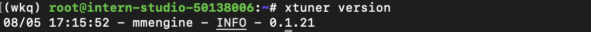

## 环境搭建

基础任务

- 使用 XTuner 微调 InternLM2-Chat-1.8B 实现自己的小助手认知，如下图所示（图中的`伍鲜同志`需替换成自己的昵称），记录复现过程并截图。
  
进阶任务

- 用自己感兴趣的知识对基座模型进行增量预训练微调
- 在资源允许的情况下，尝试实现多卡微调与分布式微调
- 将自我认知的模型上传到 OpenXLab，并将应用部署到 OpenXLab

> OpenXLab 部署教程：https://github.com/InternLM/Tutorial/tree/camp2/tools/openxlab-deploy


### 安装Xtuner

```code
# 创建一个目录，用来存放源代码
mkdir -p /root/InternLM/code
cd /root/InternLM/code
git clone -b v0.1.21  https://github.com/InternLM/XTuner /root/InternLM/code/XTuner

# 进入到源码目录
cd /root/InternLM/code/XTuner
conda activate xtuner0121

# 执行安装
pip install -e '.[deepspeed]'
```
我们可以验证一下安装结果。

```code
xtuner version
```



### 模型准备

```code
# 创建一个目录，用来存放微调的所有资料，后续的所有操作都在该路径中进行
mkdir -p /root/InternLM/XTuner
cd /root/InternLM/XTuner
mkdir -p Shanghai_AI_Laboratory
ln -s /root/share/new_models/Shanghai_AI_Laboratory/internlm2-chat-1_8b Shanghai_AI_Laboratory/internlm2-chat-1_8b
```

执行上述操作后，Shanghai_AI_Laboratory/internlm2-chat-1_8b 将直接成为一个符号链接，这个链接指向 /root/share/new_models/Shanghai_AI_Laboratory/internlm2-chat-1_8b 的位置。

使用tree命令来观察目录结构。

```code
apt-get install -y tree
tree -l
```

目录结构应该是跟tutorial一样的。

```code
├── Shanghai_AI_Laboratory
│   └── internlm2-chat-1_8b -> /root/share/new_models/Shanghai_AI_Laboratory/internlm2-chat-1_8b
│       ├── README.md
│       ├── config.json
│       ├── configuration.json
│       ├── configuration_internlm2.py
│       ├── generation_config.json
│       ├── model-00001-of-00002.safetensors
│       ├── model-00002-of-00002.safetensors
│       ├── model.safetensors.index.json
│       ├── modeling_internlm2.py
│       ├── special_tokens_map.json
│       ├── tokenization_internlm2.py
│       ├── tokenization_internlm2_fast.py
│       ├── tokenizer.model
│       └── tokenizer_config.json
```

