## 环境搭建

基础任务

- 使用 XTuner 微调 InternLM2-Chat-1.8B 实现自己的小助手认知，如下图所示（图中的`伍鲜同志`需替换成自己的昵称），记录复现过程并截图。
  
进阶任务

- 用自己感兴趣的知识对基座模型进行增量预训练微调
- 在资源允许的情况下，尝试实现多卡微调与分布式微调
- 将自我认知的模型上传到 OpenXLab，并将应用部署到 OpenXLab

> OpenXLab 部署教程：https://github.com/InternLM/Tutorial/tree/camp2/tools/openxlab-deploy


### 安装Xtuner

```code
# 创建一个目录，用来存放源代码
mkdir -p /root/InternLM/code
cd /root/InternLM/code
git clone -b v0.1.21  https://github.com/InternLM/XTuner /root/InternLM/code/XTuner

# 进入到源码目录
cd /root/InternLM/code/XTuner
conda activate xtuner0121

# 执行安装
pip install -e '.[deepspeed]'
```
我们可以验证一下安装结果。

```code
xtuner version
```


### 模型准备

```code
# 创建一个目录，用来存放微调的所有资料，后续的所有操作都在该路径中进行
mkdir -p /root/InternLM/XTuner
cd /root/InternLM/XTuner
mkdir -p Shanghai_AI_Laboratory
ln -s /root/share/new_models/Shanghai_AI_Laboratory/internlm2-chat-1_8b Shanghai_AI_Laboratory/internlm2-chat-1_8b
```

执行上述操作后，Shanghai_AI_Laboratory/internlm2-chat-1_8b 将直接成为一个符号链接，这个链接指向 /root/share/new_models/Shanghai_AI_Laboratory/internlm2-chat-1_8b 的位置。

使用tree命令来观察目录结构。

```code
apt-get install -y tree
tree -l
```

目录结构应该是跟tutorial一样的。

```code
├── Shanghai_AI_Laboratory
│   └── internlm2-chat-1_8b -> /root/share/new_models/Shanghai_AI_Laboratory/internlm2-chat-1_8b
│       ├── README.md
│       ├── config.json
│       ├── configuration.json
│       ├── configuration_internlm2.py
│       ├── generation_config.json
│       ├── model-00001-of-00002.safetensors
│       ├── model-00002-of-00002.safetensors
│       ├── model.safetensors.index.json
│       ├── modeling_internlm2.py
│       ├── special_tokens_map.json
│       ├── tokenization_internlm2.py
│       ├── tokenization_internlm2_fast.py
│       ├── tokenizer.model
│       └── tokenizer_config.json
```

## 模型部署及微调

### 微调前模型

通过网页端的 Demo 来看看微调前 internlm2-chat-1_8b 的对话效果。在本地通过浏览器访问：http://127.0.0.1:8501 来进行对话。

```code
streamlit run /root/InternLM/Tutorial/tools/xtuner_streamlit_demo.py
```


模型无法认定主人，且第二个问题无法回答。

我们接下来进行微调操作。

### 准备数据

创建脚本生成数据

```code
cd /root/InternLM/XTuner
touch xtuner_generate_assistant.py
```

将下面的代码复制进文件里：

```python
import json

# 设置用户的名字
name = 'Clement Wu'
# 设置需要重复添加的数据次数
n =  3750

# 初始化数据
data = [
    {"conversation": [{"input": "请介绍一下你自己", "output": "我是{}的小助手，内在是上海AI实验室书生·浦语的1.8B大模型哦".format(name)}]},
    {"conversation": [{"input": "你在实战营做什么", "output": "我在这里帮助{}完成XTuner微调个人小助手的任务".format(name)}]}
]

# 通过循环，将初始化的对话数据重复添加到data列表中
for i in range(n):
    data.append(data[0])
    data.append(data[1])

# 将data列表中的数据写入到'datas/assistant.json'文件中
with open('datas/assistant.json', 'w', encoding='utf-8') as f:
    # 使用json.dump方法将数据以JSON格式写入文件
    # ensure_ascii=False 确保中文字符正常显示
    # indent=4 使得文件内容格式化，便于阅读
    json.dump(data, f, ensure_ascii=False, indent=4)

```

执行此代码，我们得到目录结构如下：

```code
├── Shanghai_AI_Laboratory
│   └── internlm2-chat-1_8b -> /root/share/new_models/Shanghai_AI_Laboratory/internlm2-chat-1_8b
│       ├── README.md
│       ├── config.json
│       ├── configuration.json
│       ├── configuration_internlm2.py
│       ├── generation_config.json
│       ├── model-00001-of-00002.safetensors
│       ├── model-00002-of-00002.safetensors
│       ├── model.safetensors.index.json
│       ├── modeling_internlm2.py
│       ├── special_tokens_map.json
│       ├── tokenization_internlm2.py
│       ├── tokenization_internlm2_fast.py
│       ├── tokenizer.model
│       └── tokenizer_config.json
├── datas
│   └── assistant.json
├── xtuner_generate_assistant.py
```

### 设置配置文件

xtuner list-cfg 命令用于列出内置的所有配置文件。参数 -p 或 --pattern 表示模式匹配，后面跟着的内容将会在所有的配置文件里进行模糊匹配搜索，然后返回最有可能得内容。

```code
cd /root/InternLM/XTuner
xtuner list-cfg -p internlm2_1_8b
```
我们得到下列配置文件：


复制一个预设的配置文件

```code
xtuner copy-cfg internlm2_chat_1_8b_qlora_alpaca_e3 .
```

复制好配置文件后，我们的目录结构应该是这样子的。

```code
├── Shanghai_AI_Laboratory
│   └── internlm2-chat-1_8b -> /root/share/new_models/Shanghai_AI_Laboratory/internlm2-chat-1_8b
│       ├── README.md
│       ├── config.json
│       ├── configuration.json
│       ├── configuration_internlm2.py
│       ├── generation_config.json
│       ├── model-00001-of-00002.safetensors
│       ├── model-00002-of-00002.safetensors
│       ├── model.safetensors.index.json
│       ├── modeling_internlm2.py
│       ├── special_tokens_map.json
│       ├── tokenization_internlm2.py
│       ├── tokenization_internlm2_fast.py
│       ├── tokenizer.model
│       └── tokenizer_config.json
├── datas
│   └── assistant.json
├── internlm2_chat_1_8b_qlora_alpaca_e3_copy.py
├── xtuner_generate_assistant.py
```

### 模型训练

```code
xtuner train ./internlm2_chat_1_8b_qlora_alpaca_e3_copy.py
```

训练开始


训练结束


30% A100显卡训练20分钟就结束了。

训练完后，我们的目录结构应该是这样。

```code
├── work_dirs
│   └── internlm2_chat_1_8b_qlora_alpaca_e3_copy
│       ├── 20240805_173651
│       │   ├── 20240805_173651.log
│       │   └── vis_data
│       │       ├── 20240805_173651.json
│       │       ├── config.py
│       │       ├── eval_outputs_iter_383.txt
│       │       └── scalars.json
│       ├── internlm2_chat_1_8b_qlora_alpaca_e3_copy.py
│       ├── iter_384.pth
│       └── last_checkpoint
```

### 模型转换

将训练出来的模型权重文件转换为目前通用的 HuggingFace 格式文件。

```code
# 先获取最后保存的一个pth文件
pth_file=`ls -t ./work_dirs/internlm2_chat_1_8b_qlora_alpaca_e3_copy/*.pth | head -n 1`
export MKL_SERVICE_FORCE_INTEL=1
export MKL_THREADING_LAYER=GNU
xtuner convert pth_to_hf ./internlm2_chat_1_8b_qlora_alpaca_e3_copy.py ${pth_file} ./hf
```

### 模型合并

对于 LoRA 或者 QLoRA 微调出来的模型其实并不是一个完整的模型，而是一个额外的层（Adapter），训练完的这个层最终还是要与原模型进行合并才能被正常的使用。在 XTuner 中提供了一键合并的命令 xtuner convert merge，在使用前我们需要准备好三个路径，包括原模型的路径、训练好的 Adapter 层的（模型格式转换后的）路径以及最终保存的路径。


```code
export MKL_SERVICE_FORCE_INTEL=1
export MKL_THREADING_LAYER=GNU
xtuner convert merge /root/InternLM/XTuner/Shanghai_AI_Laboratory/internlm2-chat-1_8b ./hf ./merged --max-shard-size 2GB
```

这是merged文件夹里的数据：


### 微调后推理

再次运行xtuner_streamlit_demo.py脚本来观察微调后的对话效果，不过在运行之前，我们需要将脚本中的模型路径修改为微调后的模型的路径。

```code
# 直接修改脚本文件第18行
model_name_or_path = "/root/InternLM/XTuner/merged"
```

启动应用

```code
streamlit run /root/InternLM/Tutorial/tools/xtuner_streamlit_demo.py
```

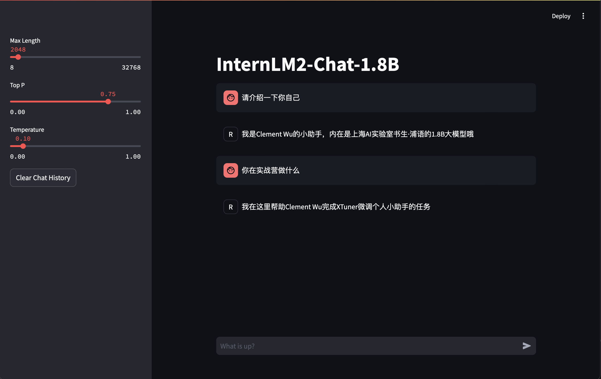

模型可以认主人并且能回答两个问题了。

## 进阶任务，基于医疗数据的模型微调

在医疗数据上进行模型微调（fine-tuning）是一项复杂且重要的任务，因为医疗数据通常涉及敏感的患者信息和高度专门化的知识。我们要求internlm2_chat_1_8b模型能够在疾病问诊方面能提供有效的建议。

本次微调数据集来自华驼模型仓库：https://github.com/SCIR-HI/Huatuo-Llama-Med-Chinese

里面含有8568条医疗问答数据。数据集本身符合standford-alpaca指令微调样本格式，我们只需要针对xtuner模版略微调整格式。

```python
import json

# Function to convert the JSON structure
def convert_json_structure(data):
    return [{"conversation": [{"input": item["instruction"], "output": item["output"]}]} for item in data]

# Initialize an empty list to hold the data
data = []

# Path to the input file
input_file_path = 'input.json'  # Replace with the correct path

# Read the file line by line
with open(input_file_path, 'r', encoding='utf-8') as file:
    for line in file:
        try:
            # Parse the JSON object from the line
            item = json.loads(line.strip())
            data.append(item)
        except json.JSONDecodeError:
            print(f"Skipping invalid line: {line}")

# Convert the JSON structure
converted_data = convert_json_structure(data)

# Path to the output file
output_file_path = 'output.json'

# Write the converted data to a new file (optional)
with open(output_file_path, 'w', encoding='utf-8') as file:
    json.dump(converted_data, file, ensure_ascii=False, indent=4)

# Print the converted data
print(json.dumps(converted_data, ensure_ascii=False, indent=4))
```

得到的数据集如下：

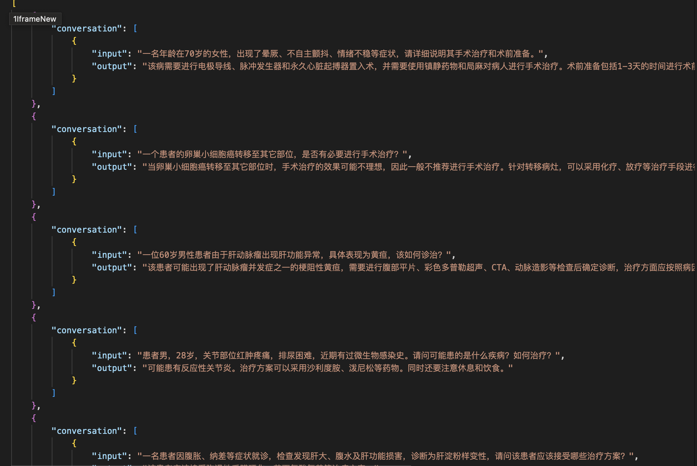

我们先关注一下internlm2_1_8b模型本身对于医疗问答的适应程度。


### 基座模型推理

我们得到以下结果，明明提问已经表示检查过了，回答仍然推荐去检查而不是具体的治疗方案，模型的理解能力有限。

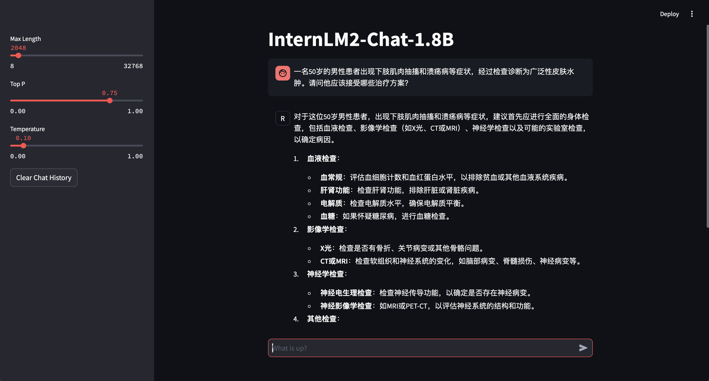


接下来我们开始微调板块，环境和模型配置同上，就不再赘述了。

我们进入internlm2_1_8b_full_custom_pretrain_e1_copy，调整模型路径配置和数据集配置。训练配置沿用基础任务的QLoRA配置, 跟之前一样把internlm2_1_8b_full_custom_pretrain_e1_copy复制进xtuner文件夹下，然后开始训练。

```code
xtuner copy-cfg internlm2_1_8b_full_custom_pretrain_e1 .
```

### 格式转换

```code
pth_file=`ls -t ./work_dirs/internlm2_1_8b_full_custom_pretrain_e1_copy/*.pth | head -n 1` && MKL_SERVICE_FORCE_INTEL=1 MKL_THREADING_LAYER=GNU xtuner convert pth_to_hf ./internlm2_1_8b_full_custom_pretrain_e1_copy.py ${pth_file} ./hf
```

### 模型合并

```code
xtuner convert merge /root/InternLM/XTuner/Shanghai_AI_Laboratory/internlm2-chat-1_8b ./hf ./medicalChat --max-shard-size 2GB
```

### 目标模型推理

改变直接修改xtuner_streamlit_demo.py脚本文件第18行为/root/InternLM/XTuner/medicalChat，再次运行：

```code
streamlit run /root/InternLM/Tutorial/tools/xtuner_streamlit_demo.py
```

得到以下结果：

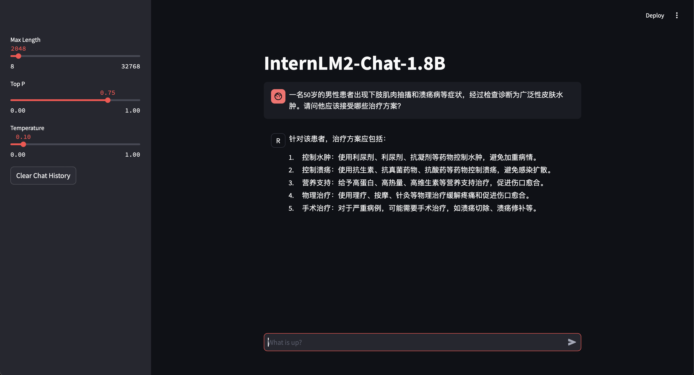

我们可以看到，模型给出了明确的治疗方案，虽然输出收到原模型的一定影响。

我们再多试两个测试用例：

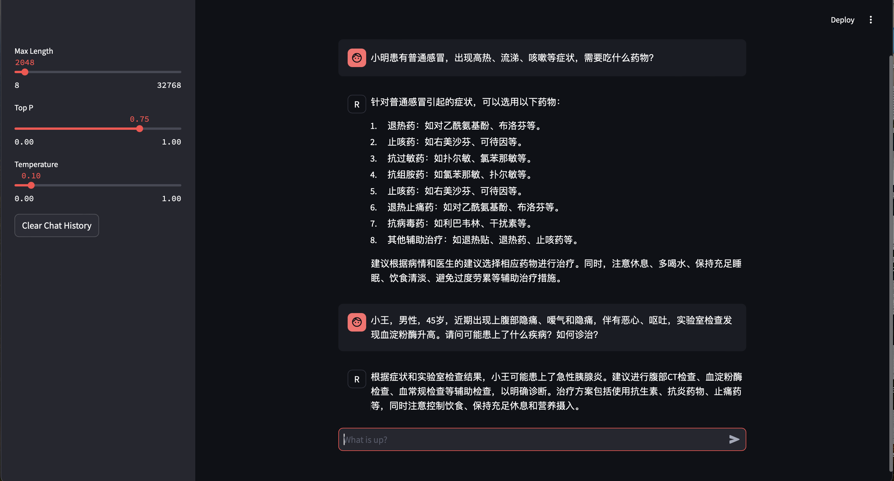

得到的回答同样比较准确，模型微调的效果应该还不错。

## OpenXLab应用部署

OpenXLab浦源平台以开源为核心，旨在构建开源开放的人工智能生态，促进学术成果的开放共享。OpenXLab面向 AI 研究员和开发者提供 AI 领域的一站式服务平台，包含数据集中心、模型中心和应用中心，致力于推动人工智能对产学研各领域全面赋能，为构建人工智能开放生态，推动人工智能科研与技术突破、交叉创新和产业落地提供全方位的平台支撑。

首先需要在OpenXLab先创建一个空模型仓库。

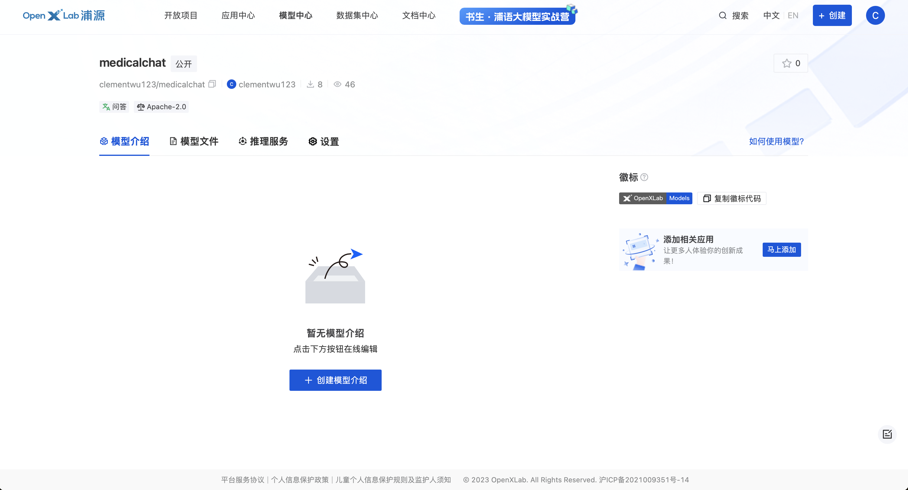

从本地上传刚刚微调的模型到模型仓库。

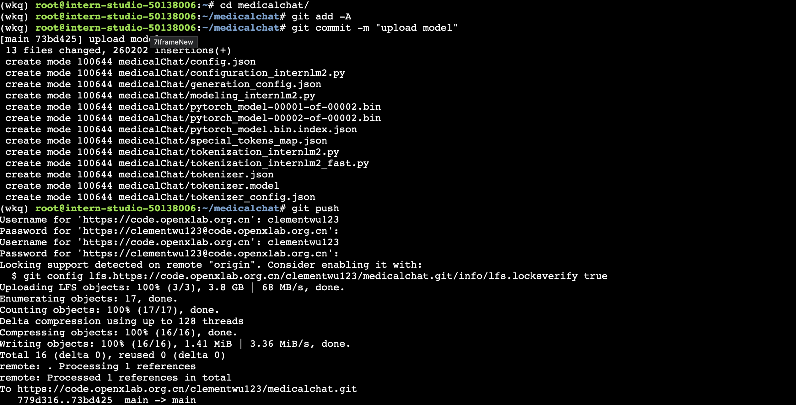

我们可以看到模型被上传到线上仓库。

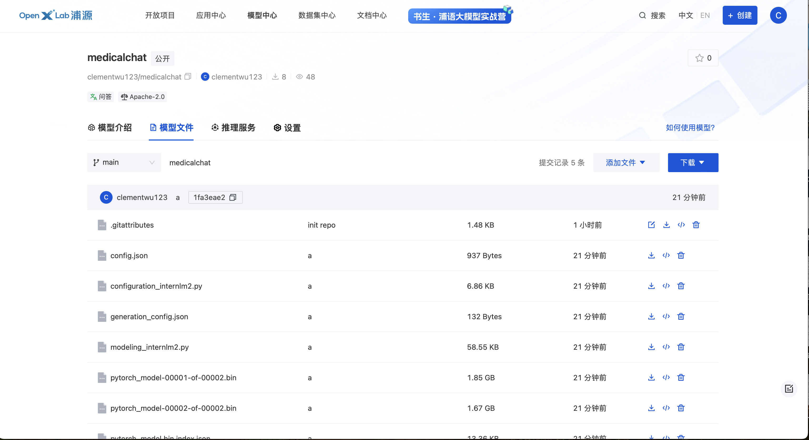

创建一个新的GitHub仓库来存放gradio应用代码。例如创建一个model_depoly的代码仓库，推荐的项目结构如下：

```code
├─GitHub_Repo_Name
│  ├─app.py                 # Gradio 应用默认启动文件为app.py，应用代码相关的文件包含模型推理，应用的前端配置代码
│  ├─requirements.txt       # 安装运行所需要的 Python 库依赖（pip 安装）
│  ├─packages.txt           # 安装运行所需要的 Debian 依赖项（ apt-get 安装）
|  ├─README.md              # 编写应用相关的介绍性的文档
│  └─... 
```

requirement.txt 配置 python相关的依赖包，例如 gradio、torch、transformers 等

```code
gradio==4.10.0
transformers
sentencepiece
einops
accelerate
tiktoken
```

packages.txt 配置下载模型权重的工具包 git 和 git-lfs

```code
git
git-lfs
```

编写一个app.py文件，里面可以通过transformers框架进行模型实例化并通过gradio组件搭建chat聊天界面，本次代码都存放在 GitHub示例代码仓库中

```python
import gradio as gr
import os
import torch
from transformers import AutoModelForCausalLM, AutoTokenizer, AutoModel

base_path = './medicalChat'
os.system(f'git clone https://code.openxlab.org.cn/clementwu123/medicalchat.git {base_path}')
os.system(f'cd {base_path} && git lfs pull')

tokenizer = AutoTokenizer.from_pretrained(base_path,trust_remote_code=True)
model = AutoModelForCausalLM.from_pretrained(base_path,trust_remote_code=True, torch_dtype=torch.float16).cuda()

def chat(message,history):
    for response,history in model.stream_chat(tokenizer,message,history,max_length=2048,top_p=0.75,temperature=1):
        yield response

gr.ChatInterface(chat,
                 title="InternLM2-medicalChat",
                description="""
InternLM is mainly developed by Shanghai AI Laboratory.  
                 """,
                 ).queue(1).launch()
```

以上文件被放在这个仓库里https://github.com/ClementWu123/model_depoly

在OpenXLab浦源平台中，部署写好的chat web-ui的应用

在网页右上角点击创建gradio应用

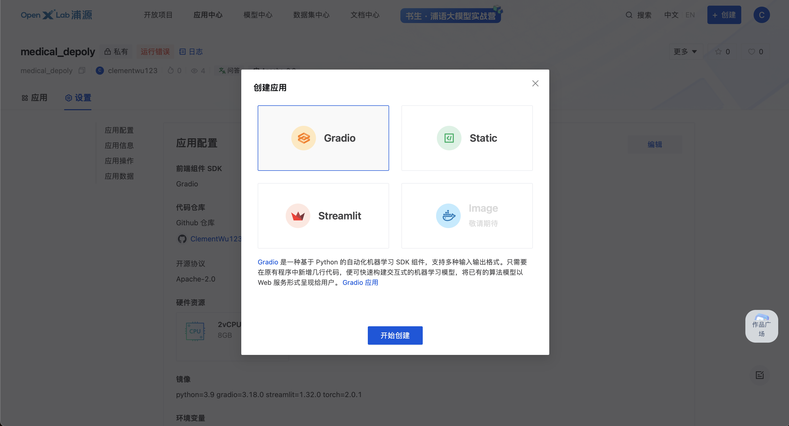

配置如下

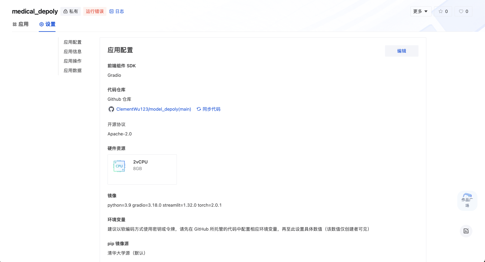

应用创作结束后自动开始构建。

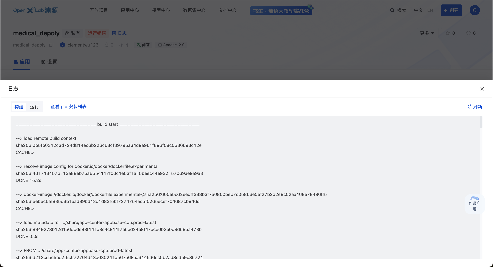

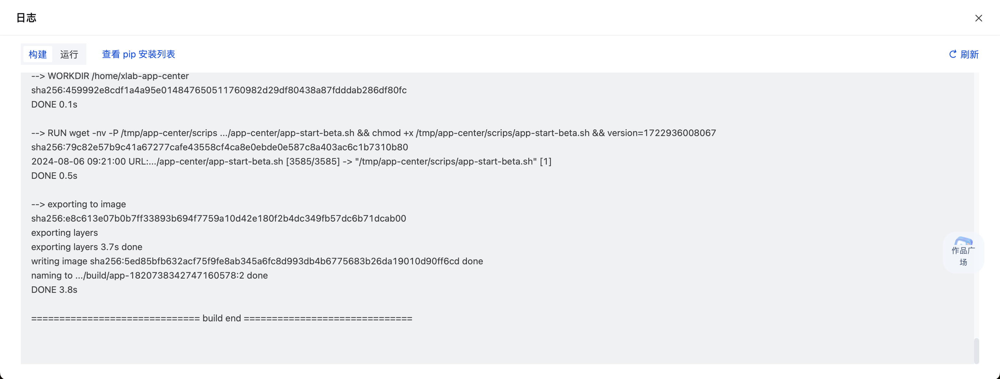

因为GPU计算资源还没申请下来，应用暂时无法运行。后面再说了。

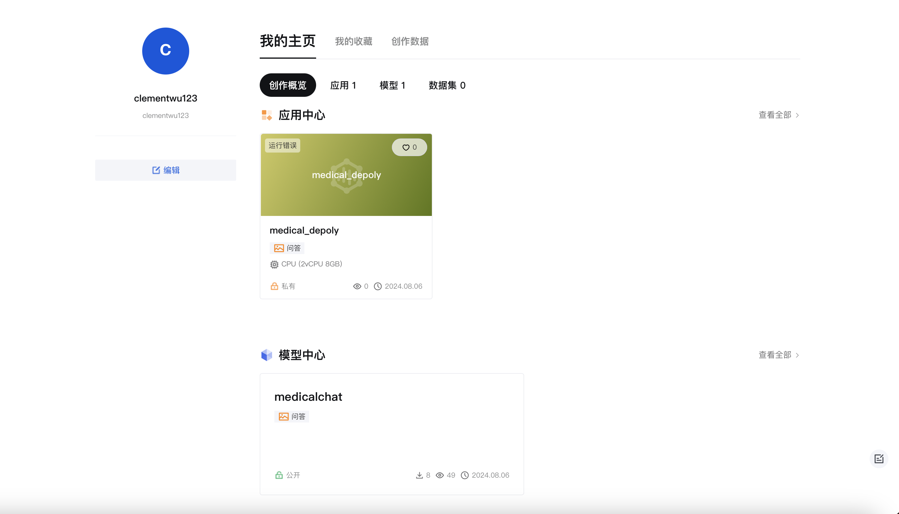


