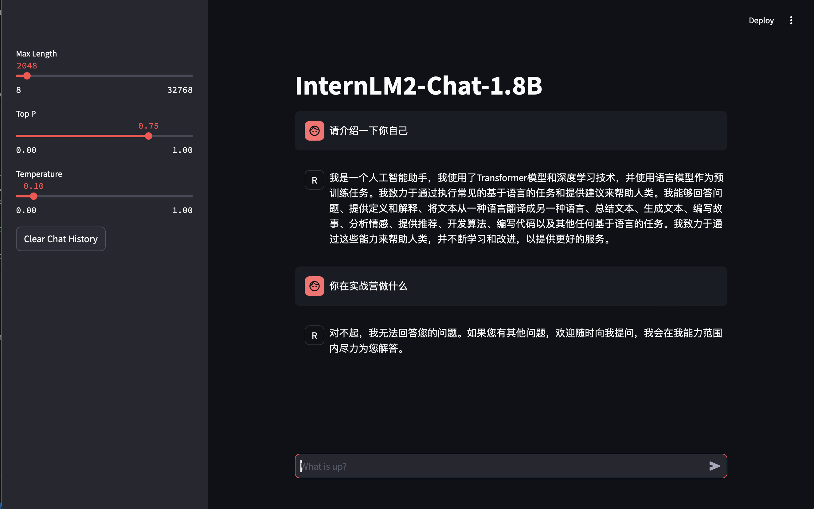
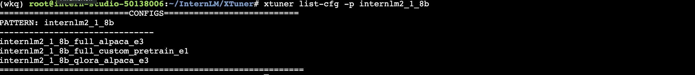
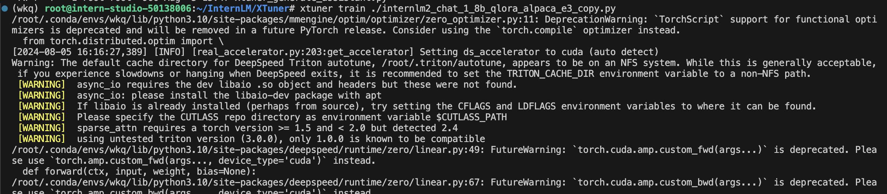
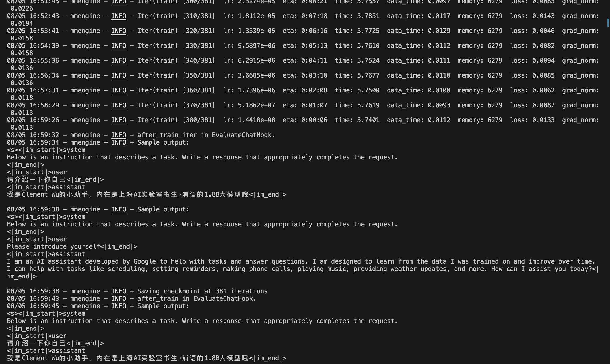
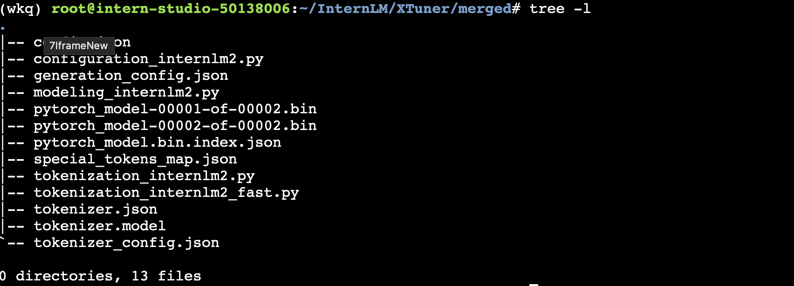

## 环境搭建

基础任务

- 使用 XTuner 微调 InternLM2-Chat-1.8B 实现自己的小助手认知，如下图所示（图中的`伍鲜同志`需替换成自己的昵称），记录复现过程并截图。
  
进阶任务

- 用自己感兴趣的知识对基座模型进行增量预训练微调
- 在资源允许的情况下，尝试实现多卡微调与分布式微调
- 将自我认知的模型上传到 OpenXLab，并将应用部署到 OpenXLab

> OpenXLab 部署教程：https://github.com/InternLM/Tutorial/tree/camp2/tools/openxlab-deploy


### 安装Xtuner

```code
# 创建一个目录，用来存放源代码
mkdir -p /root/InternLM/code
cd /root/InternLM/code
git clone -b v0.1.21  https://github.com/InternLM/XTuner /root/InternLM/code/XTuner

# 进入到源码目录
cd /root/InternLM/code/XTuner
conda activate xtuner0121

# 执行安装
pip install -e '.[deepspeed]'
```
我们可以验证一下安装结果。

```code
xtuner version
```


### 模型准备

```code
# 创建一个目录，用来存放微调的所有资料，后续的所有操作都在该路径中进行
mkdir -p /root/InternLM/XTuner
cd /root/InternLM/XTuner
mkdir -p Shanghai_AI_Laboratory
ln -s /root/share/new_models/Shanghai_AI_Laboratory/internlm2-chat-1_8b Shanghai_AI_Laboratory/internlm2-chat-1_8b
```

执行上述操作后，Shanghai_AI_Laboratory/internlm2-chat-1_8b 将直接成为一个符号链接，这个链接指向 /root/share/new_models/Shanghai_AI_Laboratory/internlm2-chat-1_8b 的位置。

使用tree命令来观察目录结构。

```code
apt-get install -y tree
tree -l
```

目录结构应该是跟tutorial一样的。

```code
├── Shanghai_AI_Laboratory
│   └── internlm2-chat-1_8b -> /root/share/new_models/Shanghai_AI_Laboratory/internlm2-chat-1_8b
│       ├── README.md
│       ├── config.json
│       ├── configuration.json
│       ├── configuration_internlm2.py
│       ├── generation_config.json
│       ├── model-00001-of-00002.safetensors
│       ├── model-00002-of-00002.safetensors
│       ├── model.safetensors.index.json
│       ├── modeling_internlm2.py
│       ├── special_tokens_map.json
│       ├── tokenization_internlm2.py
│       ├── tokenization_internlm2_fast.py
│       ├── tokenizer.model
│       └── tokenizer_config.json
```

## 模型部署及微调

### 微调前模型

通过网页端的 Demo 来看看微调前 internlm2-chat-1_8b 的对话效果。在本地通过浏览器访问：http://127.0.0.1:8501 来进行对话。

```code
streamlit run /root/InternLM/Tutorial/tools/xtuner_streamlit_demo.py
```



模型无法认定主人，且第二个问题无法回答。

我们接下来进行微调操作。

### 准备数据

创建脚本生成数据

```code
cd /root/InternLM/XTuner
touch xtuner_generate_assistant.py
```

将下面的代码复制进文件里：

```python
import json

# 设置用户的名字
name = 'Clement Wu'
# 设置需要重复添加的数据次数
n =  3750

# 初始化数据
data = [
    {"conversation": [{"input": "请介绍一下你自己", "output": "我是{}的小助手，内在是上海AI实验室书生·浦语的1.8B大模型哦".format(name)}]},
    {"conversation": [{"input": "你在实战营做什么", "output": "我在这里帮助{}完成XTuner微调个人小助手的任务".format(name)}]}
]

# 通过循环，将初始化的对话数据重复添加到data列表中
for i in range(n):
    data.append(data[0])
    data.append(data[1])

# 将data列表中的数据写入到'datas/assistant.json'文件中
with open('datas/assistant.json', 'w', encoding='utf-8') as f:
    # 使用json.dump方法将数据以JSON格式写入文件
    # ensure_ascii=False 确保中文字符正常显示
    # indent=4 使得文件内容格式化，便于阅读
    json.dump(data, f, ensure_ascii=False, indent=4)

```

执行此代码，我们得到目录结构如下：

```code
├── Shanghai_AI_Laboratory
│   └── internlm2-chat-1_8b -> /root/share/new_models/Shanghai_AI_Laboratory/internlm2-chat-1_8b
│       ├── README.md
│       ├── config.json
│       ├── configuration.json
│       ├── configuration_internlm2.py
│       ├── generation_config.json
│       ├── model-00001-of-00002.safetensors
│       ├── model-00002-of-00002.safetensors
│       ├── model.safetensors.index.json
│       ├── modeling_internlm2.py
│       ├── special_tokens_map.json
│       ├── tokenization_internlm2.py
│       ├── tokenization_internlm2_fast.py
│       ├── tokenizer.model
│       └── tokenizer_config.json
├── datas
│   └── assistant.json
├── xtuner_generate_assistant.py
```

### 设置配置文件

xtuner list-cfg 命令用于列出内置的所有配置文件。参数 -p 或 --pattern 表示模式匹配，后面跟着的内容将会在所有的配置文件里进行模糊匹配搜索，然后返回最有可能得内容。

```code
cd /root/InternLM/XTuner
xtuner list-cfg -p internlm2_1_8b
```
我们得到下列配置文件：



复制一个预设的配置文件

```code
xtuner copy-cfg internlm2_chat_1_8b_qlora_alpaca_e3 .
```

复制好配置文件后，我们的目录结构应该是这样子的。

```code
├── Shanghai_AI_Laboratory
│   └── internlm2-chat-1_8b -> /root/share/new_models/Shanghai_AI_Laboratory/internlm2-chat-1_8b
│       ├── README.md
│       ├── config.json
│       ├── configuration.json
│       ├── configuration_internlm2.py
│       ├── generation_config.json
│       ├── model-00001-of-00002.safetensors
│       ├── model-00002-of-00002.safetensors
│       ├── model.safetensors.index.json
│       ├── modeling_internlm2.py
│       ├── special_tokens_map.json
│       ├── tokenization_internlm2.py
│       ├── tokenization_internlm2_fast.py
│       ├── tokenizer.model
│       └── tokenizer_config.json
├── datas
│   └── assistant.json
├── internlm2_chat_1_8b_qlora_alpaca_e3_copy.py
├── xtuner_generate_assistant.py
```

### 模型训练

```code
xtuner train ./internlm2_chat_1_8b_qlora_alpaca_e3_copy.py
```

训练开始



训练结束



30% A100显卡训练20分钟就结束了。

训练完后，我们的目录结构应该是这样。

```code
├── work_dirs
│   └── internlm2_chat_1_8b_qlora_alpaca_e3_copy
│       ├── 20240805_173651
│       │   ├── 20240805_173651.log
│       │   └── vis_data
│       │       ├── 20240805_173651.json
│       │       ├── config.py
│       │       ├── eval_outputs_iter_383.txt
│       │       └── scalars.json
│       ├── internlm2_chat_1_8b_qlora_alpaca_e3_copy.py
│       ├── iter_384.pth
│       └── last_checkpoint
```

### 模型转换

将训练出来的模型权重文件转换为目前通用的 HuggingFace 格式文件。

```code
# 先获取最后保存的一个pth文件
pth_file=`ls -t ./work_dirs/internlm2_chat_1_8b_qlora_alpaca_e3_copy/*.pth | head -n 1`
export MKL_SERVICE_FORCE_INTEL=1
export MKL_THREADING_LAYER=GNU
xtuner convert pth_to_hf ./internlm2_chat_1_8b_qlora_alpaca_e3_copy.py ${pth_file} ./hf
```

### 模型合并

对于 LoRA 或者 QLoRA 微调出来的模型其实并不是一个完整的模型，而是一个额外的层（Adapter），训练完的这个层最终还是要与原模型进行合并才能被正常的使用。在 XTuner 中提供了一键合并的命令 xtuner convert merge，在使用前我们需要准备好三个路径，包括原模型的路径、训练好的 Adapter 层的（模型格式转换后的）路径以及最终保存的路径。


```code
export MKL_SERVICE_FORCE_INTEL=1
export MKL_THREADING_LAYER=GNU
xtuner convert merge /root/InternLM/XTuner/Shanghai_AI_Laboratory/internlm2-chat-1_8b ./hf ./merged --max-shard-size 2GB
```

这是merged文件夹里的数据：




